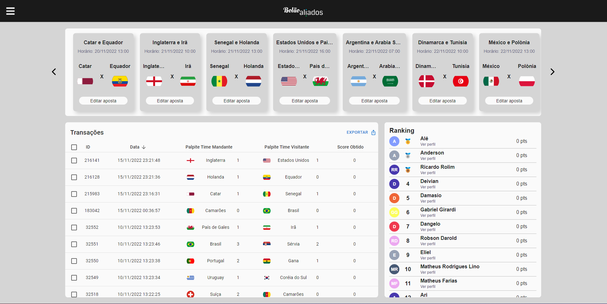
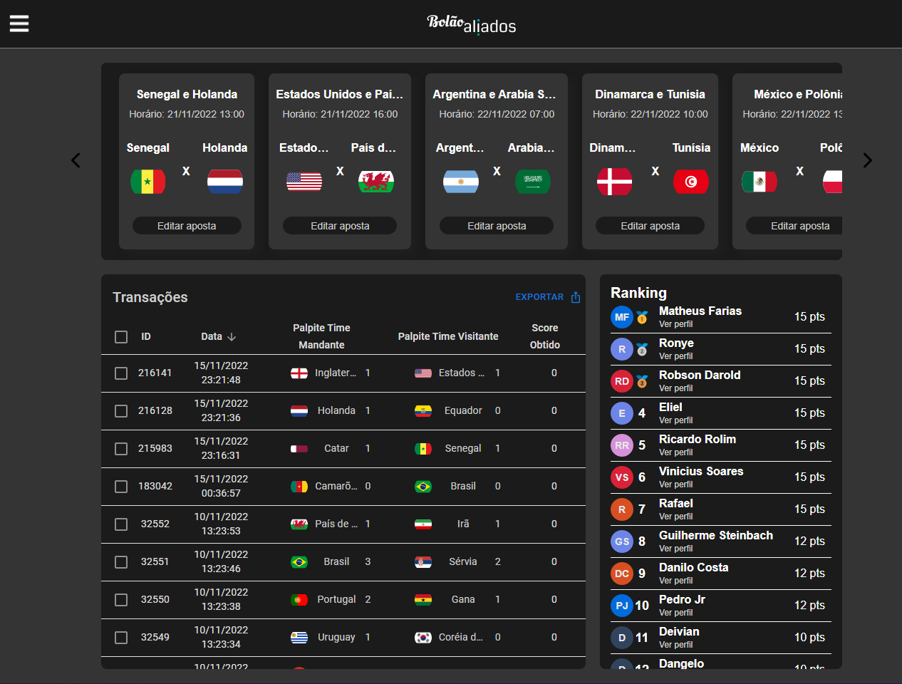

# Bolão Aliados
A football betting platform with ReactJs and Quarkus

## Features

- ⚛️ **React Js** — A JavaScript library for building user interfaces
- 🚀 **Quarkus** — A supersonic, subatomic framework java stack for OpenJDK HotSpot
- 🐘 **PostgreSQL** — An open-source object-relational database
- 🔓 **JWT** - A compact URL-safe means of representing claims to be transferred between two parties.

## Getting started

1. Clone this repo using `git clone git@github.com:vinisoaresr/Bolao-Aliados.git`
2. Move yourself to the appropriate directory: `cd Bolao-Aliados`
 
### Getting started with the backend server

1. Move yourself to the backend folder: `cd backend`
2. Create a custom `application.properties` file on `backend/src/main/resources/` and insert all of properties
3. Run `mvn quarkus:dev` to start the server

### Getting started with the frontend app

1. Move yourself to the frontend folder: `cd frontend`
2. Create a `.env` file and add the path to API server with key `REACT_APP_BACKEND_URL` 
> Example: "REACT_APP_BACKEND_URL=http://localhost/api"
2. Run `npm run dev` to start the web application

## TODO:

- [X] Minimum viable product (MVP)
- [X] Deploy to Azure
- [ ] Add support to HTTPS
- [ ] Add linter to repo (standardization)
- [ ] Tests (100% coverage)
- [ ] Refactor backend and fronted with Clean Architecture 
- [ ] Refactor use case refresh ranking (backend)

## License

This project is licensed under the MIT License - see the [LICENSE](https://opensource.org/licenses/MIT) page for details.

  

